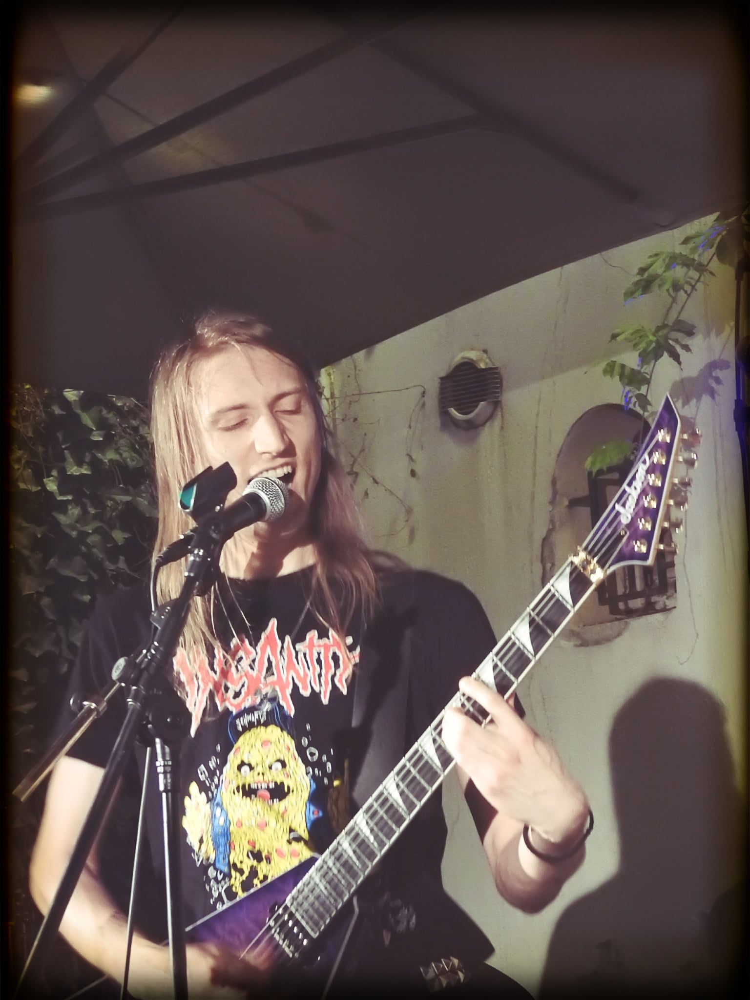

+++
title = "Raphaël Colin's personal website"
+++
# How did you find yourself here?

Hi, I'm Raphaël and you happened to stumble upon my personal website :)

  

## About me

I am currently doing a PhD in computer science in the
[ICPS team of the ICube laboratory](https://icps.icube.unistra.fr/).

I work on compiler optimizations and speculative runtime code transformations,
more specifically on the subject of **multi-versioning**. That means,
selecting the best performing version of a given program in a given
execution context.

I like computers, music (especially of the metal variety), singing karaoke and
beer.

I'm the guitar player in a small french thrash metal band called **Kernel Panik**
(I am very happy with that name). You can find our music [here](https://soundcloud.com/kernel-panik) and
follow us on Instagram [here](https://www.instagram.com/kernel_panik_thrash/).

### Blog

You can find my blog [here](blog) where I write about whatever topic I find
interesting at the moment (provided I have enough motivation to write).

### Contact

You can contact me on
[LinkedIn](https://www.linkedin.com/in/rapha%C3%ABl-colin-38a455221/) (I'm not
really sure about having my e-mail address in public).
