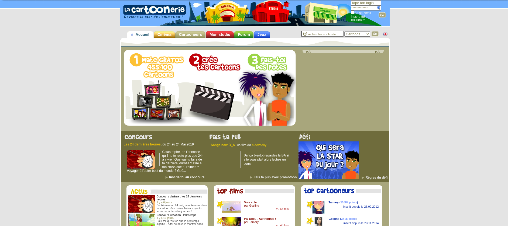

+++
title = "La Cartoonerie"
date = 2024-12-12
author = "Raphaël Colin"
+++

In 2019, I was in the final year of my computer science bachelor and needed to
find an internship in order to get the degree. At this point, I wasn't
desperate enough to give up on finding an internship in something that
interested me.

At the time, I was interested in games and educational stuff, mostly related to
creation tools. This lead me to think about _La Cartoonerie_, a website for
creating and sharing cartoons which really left a mark on the childhood of many
French people of my generation.

### The end of Adobe Flash Player

For a little context, 2019 was the time when the world learned that support for
Adobe Flash Player in browsers was gonna get dropped, and I was wondering what
this website (which was based on flash) had become, and how they were planning
to handle the end of Flash. After all, maybe they needed some hands to convert
the tool to HTML5? Perfect for an internship!

When searching for it, I stumbled upon forum posts on _La Cartoonerie_,
discussing the end of Flash, and how to deal with it. To my horror, people were
saying that the owners of the website basically went away with the key, and it
was impossible for people to make a transition to HTML5 because they had no
access to the code, and couldn't inherit the ownership of the site.

Most of the users in this forum post were people who had discovered the website
when they were a child, but then kept returning to it and creating new things.
_La Cartoonerie_ was evidently precious to them.
This is a sad story, but a lot of popular cartoons made on the website were
eventually exported to the official [Youtube
channel](https://www.youtube.com/@lacartoonerie/videos), so those cartoons
aren't [lost media](https://fr.wikipedia.org/wiki/Lost_media) (yet).

Despite me thinking about the website because of the end of Flash and
rediscovering _La Cartoonerie_ during this specific period, this post is not
about the death of web tools and games and how to preserve them and keep them
usable in the long run. I could also write about this topic, but I'm sure
others have already said a lot of interesting things about it. The rest of this
blog post is actually about creation games (I believe the frontier is quite
blurry), using _La Cartoonerie_ as a kind of reference point.

### La Cartoonerie itself

To start, I would like to give a brief history and description of _La
Cartoonerie_. The history part is mostly for context's sake, and the
description will help me define what I mean precisely with the term "creation
game" in the next section.

From what I could find, _La Cartoonerie_ was created in 2006 by three people
on their spare time before leaving their jobs to work on it full time[^1].
They even managed to get contracts with some big french media at some point,
showing that it was quite popular[^2].
Since 2010, the website has been managed by the community, and an association
named LAKASSOCIATION was created in 2017. The association still exists, but is
probably not active anymore given the death of Flash.

The website itself looks like a lot of browser-based multiplayer games of the
time. The interface was pretty childish but usable, I remember that you could
sometimes got some floating bills that rewarded you with in-game money when you
clicked on them.

<figure class="centered">

<figcaption class="caption"><i>La Cartoonerie</i>'s main page in 2019.<figcaption/>
</figure>

There was of course the "theater" where you could go watch some new popular
cartoons, or the new episode of a show you were following. In particular, I
remember a series named "Lonely Vampire" which you can find on Youtube. It
looks pretty cheap when watching it now, but trust me, making these animations
must have taken the author countless hours given the tools available, and when
I was a kid, I couldn't imagine ever being able to do something like that (I
still don't).

But the real **heart** of this website was the cartoon editor. It's made with
Flash, so it is laggy, and it gets more and more laggy as you add stuff to the
scene. The UI is a bit hard to use if you're clumsy like me, and obviously,
since all of this is targeted at children, it's pretty limited. But these
limitations are what makes everything interesting right? This is a theme that
really speaks to me and is related to my [last
post](@/blog/these_boots/index.md). We will get to that later. To be accurate,
there actually was multiple different modes you could choose in the editor: a
simplified mode allowing everyone to make simple cartoons easily, and an
advanced mode giving more control to more experienced users.

Once in the editor, you could switch between different tools: the "casting" tool
for creating and editing characters; the "sets" for creating and editing backgrounds
for your cartoon; and finally, the "shooting" tool where the actual animation
work happened, bringing your characters and decors to life.
The animation tool was somewhat simplified, but had pretty much everything you
would expect: you could move the character's joints and change object
properties such as scale, transform, rotation, etc. Of course,
[keyframes](https://en.wikipedia.org/wiki/Key_frame) could be inserted in a
timeline, and the animation engine would then do an interpolation between those
keyframes, giving us... Animations! The editor also provided you with basic
animations like walking, running, moving lips for characters, etc. For audio,
you could upload your own files or use provided sound effects and music. All
dialogue was handled with speech bubbles like in a comic, and _voilà_! That's
pretty much everything you could do in this editor.

### Creation games

Now, what is a _creation game_ then?

I'm not using the term "creative game" as that could mean a game that itself is
creative. To me, _creation games_ are centered around creation, and creating
something, be it music, animations, games, etc. is the central part. They are
often presented as games, but usually are a lot closer to actual tools.

Many games allow players to create. Outside of creation games, games often
include level editors. I'm thinking of games such as _Super Mario Maker_ or
_Portal 2_ for example. Here, players can express themselves through the
level editor, and the community efforts always result in great levels,
enhancing the experience of everyone, and allowing players to get a
taste of what level design is like. I'm drawing a line between these
types of editors and creation games, as in this case, the creativity
of the players is always bounded by the limits and rules of the original
game. A user-made level in _Super Mario Maker_ will always conform to the
rules of a _Mario_ game, even if many levels are very creative and
stretch the game system to its limits. _Portal 2_ is a bit more permissive,
but stays a bit limited (especially if we only consider community levels made
with the in-game editor).

Some games with level editors get much closer to creation games without being
full-on creation games. I would say these games (or these games' map editors)
are on the blurry frontier between normal games and creation games.
I'm thinking about real time strategy (RTS) games such as _Starcraft II_ or
_Warcraft III_. These games offer map editors so complete that people actually
actually created entirely different games in them, stretching the limits of
the engine to the maximum. For instance, people made an MMORPG-style game
in the _Starcraft II_ arcade[^3], and even shooter games[^4]. The fact that
_DotA_ was originally a custom map for _Warcraft III_, which eventually
gave birth to the whole MOBA genre of games, is proof of the crazy
possibilities these in-game editors provide. We could also mention
_Couter Strike_ which was originally a mod of _Half Life_, but since
this is a mod, I believe it's a little different to something made
entirely in an in-game editor. These games with incredibly advanced editors
close the gap to creation games, but with that said, I think it would
be a stretch to call them creation games, because the main focus
of these games, their goal, is not creation. These games were made
as strategy games, their whole purpose is not about creating and sharing
custom maps, even though they provide the tools to do so.

This brings me to actual creation games. The examples I want to take for this
section are: _Flipnote Studio_[^5] and _Dreams_[^6]. Those are games that are
specifically centered around the act of creating stuff: flipbook-style
animations in the case of _Flipnote_ (which is also a game of my childhood),
and games in the case of _Dreams_. Creations can then be shared with the
community, and even improved-on by other users in some cases. _La Cartoonerie_'s
central focus as a creation game, is on the creation of cartoons. As a
web-based creation game, I think _La Cartoonerie_ is a bit more accessible
to everyone, and the user interface is less limited than with a DS screen or
a _Playstation_ controller.

The reason I love creation games is that they allow users with no prior skills
to create music, games, art, animations, etc. But these games are different
to traditional tools because they still need to pass as games, and not just
_software_. In fact, I believe they fall on a spectrum according to how simple
or how complex they are, and how much or how little control they provide users.

### Complexity and features in creation games

In their quest to make creation accessible to everyone, creation games
need to determine how much or how little control and features they provide the
users. This choice is closely related to the complexity of the final tool: more
control and features means more choices to be made for the user, more menus,
more stuff to think about; less features means a simpler, but more limited tool.
In both cases, too much complexity or too much simplicity can prevent non-expert
users from making what they want. I will try to illustrate this with _Flipnote_
and _Dreams_.

I love _Flipnote_, but I believe it falls in the category of creation games
that are **too** simple. Few creation games get simpler than _Flipnote_: you
can draw with your DSi stylus, creating animation frames, you have access to
two different layers and two different colors, and that's pretty much it. No
joints, no keyframes, no other feature. This is cool, but it is so simplistic
that it pretty much reduces your ability to make a cool animation to your
ability to draw. If you can draw and animate pretty well by hand, you'll be
able to make cool animations. If you can't, you're screwed. It's just a
flipbook in the end.

I haven't played _Dreams_ a lot, but to me, it's the opposite. _Dreams_ offers
a huge amount of features and stuff to do: you can make 3D models, music,
logic, etc. Everything needed to make a video game. For example, you don't need
to know how to code to make logic in _Dreams_: you can make logic circuits
using blocks, in a kind of visual programming language similar to _Scratch_.
It's a bit more difficult for graphics, but since everyone has to use a
_Playstation_ controller, learning to make 3D models in _Dreams_ becomes
a skill on its own, and that's the thing: _Dreams_ contains so many
features, so many things, it offers so much control, that in order to
make something really interesting, you have to become skilled. In this
case, you don't have to become skilled in 3D modeling or programming on their
own, but you have to become good at using the _Dreams_ editor itself.

I would say those are the two extremes of creation games: in the first case, the tool
is so simple that the limiting factor becomes the ability of users in a specific
skill like drawing; in the second case, users have to train their ability to use
the tool itself.

In my opinion, _La Cartoonerie_ falls in a bit more balanced spot. It is closer
to _Dreams_ than it is to _Flipnote_, but the tool itself is much more limited,
resulting in a much shorter learning curve. As an animation tool, it differs
from _Flipnote_ by imposing its own way of making characters, backgrounds,
and animations. You could say it has its own _language_, which brings me
to my last point.

### Language and "metagame" in creation games

In this last section

---
[^1]: [_La Cartoonerie_ archived page](https://web.archive.org/web/20070206105413/http://www.lacartoonerie.com/home/pages/about_presentation.php).
[^2]: [Alexis Godais's LinkedIn profile](https://www.linkedin.com/in/alexisgodais/details/experience/?locale=fr_FR)
[^3]: [Starcraft Universe page on the Starcraft fandom wiki](https://starcraft.fandom.com/wiki/StarCraft_Universe)
[^4]: [Big Battlefield page on sc2arcade.com](https://sc2arcade.com/map/1/203432/)
[^5]: [Flipnote Studio Wikipedia page](https://en.wikipedia.org/wiki/Flipnote_Studio)
[^6]: [Dreams Wikipedia page](https://en.wikipedia.org/wiki/Dreams_(video_game))
